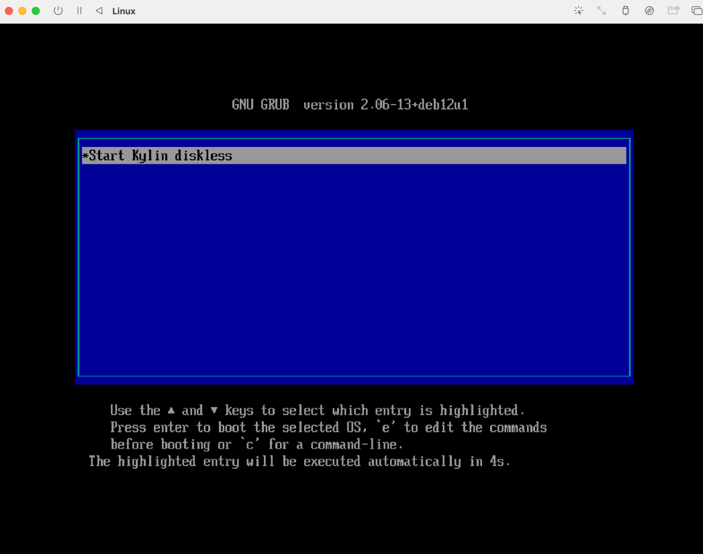

# alpine-pxe

## 系统生成
### 复制系统
```shell
sudo rsync -Pa / /no-disk --exclude={/proc,/sys,/dev,/run,/tmp,/mnt,/media,/lost+found,/no-disk}
sudo mkdir /proc /sys /dev /run /tmp /mnt /media
```
### 把系统生成filesystem.squashfs文件
```shell
sudo mksquashfs no-disk filesystem.squashfs -comp xz
```
### 创建新文件夹
```shell
sudo mkdir ~/iso ~/new-iso
```
### 挂载系统
```shell
sudo mount -o loop /data/Kylin-Desktop-V10-SP1-General-Release-2303-ARM64.iso  ~/iso/
```
### 把系统复制到new-iso
```shell
 sudo cp -rT ~/iso ~/new-iso
```
### 卸载iso文件夹
```shell
 sudo umount ~/iso
```

### 删除系统的md5 和filesystem.squashfs
```shell
sudo rm -rf ~/new-iso/md5sum.txt
sudo rm -rf ~/new-iso/casper/filesystem.squashfs
```
### 把之前生成的filesystem复制到casper下
```shell
mv /filesystem.squashfs ~/new-iso/casper/
```
### 重新生成md5
```shell
 sudo sh -c "cd /home/用户/new-iso && find . -type f -print0 | xargs -0 md5sum > md5sum.txt"
```

## 无盘服务器安装
[pxe镜像安装gitee](https://gitee.com/nuoee/alpine-pxe) https://gitee.com/nuoee/alpine-pxe

[pxe镜像安装github](https://github.com/moses-keqi/pxe) https://github.com/moses-keqi/pxe

### 1、 启动UEFI PXEv4

### 2、下载bootnetaa64

### 3、加载系统

### 4、进入系统


### 5、 kylin 目录是解压Kylin-Desktop-V10-SP1-General-Release-2303-ARM64.iso 目录中的文件 find ./ -name "名称"
 > initrd.lz
> vmlinuz

## 安装问题
#### 1、pxe镜像安装 中debian-installer 文件必须是有读权限
```shell
  tftp -g -r debian-installer/arm64/bootnetaa64.efi  192.168.0.180
```
#### 1.1、截图测试


## TODO待解决文件、无盘启动后不能联网

